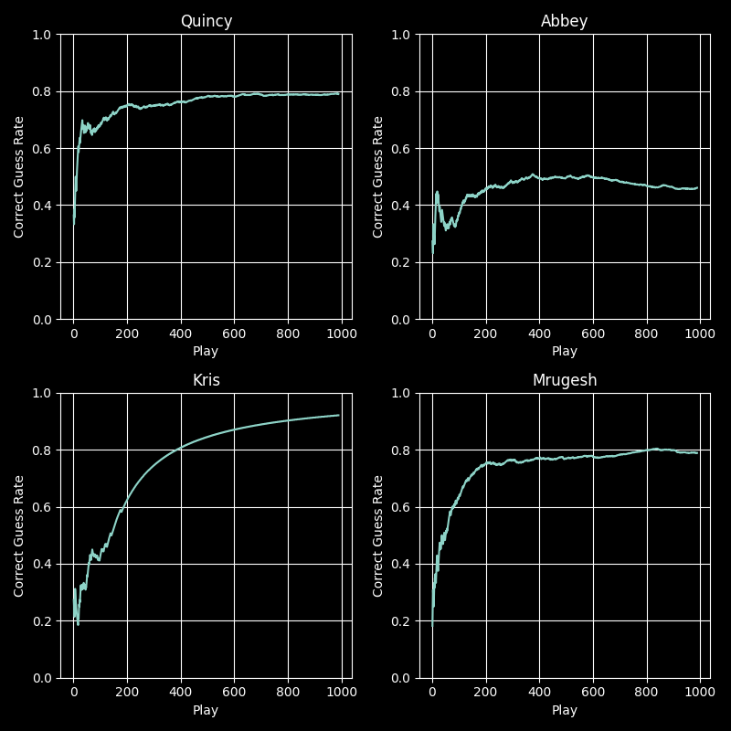

# Rock-paper-scissors Neural Network Play Generator

## Intro
This is a proposed solution for the [challenge project](https://www.freecodecamp.org/learn/machine-learning-with-python/machine-learning-with-python-projects/rock-paper-scissors) from the freecodecamp.org course *"Machine Learning with Python"*. The challenge is essentially about predicting the opponent's plays in a rock-paper-scissors game. The objective of this challenge is to achieve a win rate of at least 60% in one thousand matches against each of four different artificial inteligence play generators. To accomplish this, a neural network prediction method was used.

The challenge project consist of three Python script files:

1. main.py - calls necessary functions from other files.
2. RPS_game.py - game code file that receives outputs from play generation functions. It also includes the four play generation functions: 'Quincy', 'Abbey', 'Kris' and 'Mrugesh'.
3. RPS.py - a file that must be edited in order to accomplish the challenge goal.

## Methodology
A simple recurrent neural network was used for training and prediction. The input was sequences based on the opponent play history. More details about the play generation algorithm is shown in the [RPS.py](RPS.py) file.

## Results
All challenge objectives were achieved with the following win rates:
- 84.6% against Quincy
- 61.8% against Abbey
- 95.3% against Kris
- 84.3% against Mrugesh

[Collected data .csv files](Data)

The figure below shows plots of the `Correct Guess Rate` versus `Play`.

The `Correct Guess Rate` is the percentage of successfully predicted opponent plays. Final win rates do not equate to this quantity for two reasons: (1) win rates take into account the entire history of plays and (2) they exclude tied games. The `Correct Guess Rate` is the most suitable parameter to track neural network performance as it indicates exclusively correct predictions.

A few observations can be made based on the graphics: (1) Prediction quality improves over time in all cases. This is expected as the opponent's play pattern becomes more consistent with a larger sample size. (2) The first few matches are always unstable. In contrast to a larger sample size, the unpredictability and lack of data explain why predictions are not accurate. (3) The 'Abbey' play generator was particularly difficult to predict. Upon analyzing the play function, it was identified that the opponent's plays have a strong dependency on the neural network play history. This circular learning process hindered effective prediction. To overcome this, a strict training process was necessary.

Regarding the training process, the employed method, the 'SimpleRNN' layer, was sufficient; however, the length of input sequences played a crucial role in improving predictions. Since the sequences are based on the opponent's play history, larger sequences resulted in faster training of the neural network but often led to incorrect predictions. Conversely, the entire opponent's play history could be divided into several smaller sequences, increasing input data and demanding more computational resources, but improving predictions.

This situation is a classical problem of hyperparameter optimization, which involves finding an optimal value for the sequence length that is large enough to be trained quickly yet small enough to maintain the necessary nuances for correct prediction. For this problem, a sequence length of 60% of the opponent's play history was a viable value to meet the challenge conditions without requiring extensive processing time.

## Final Considerations
In a sufficiently large sample, a completely random method would have a 1/3 chance of prediction. Therefore, any result above this value can be interpreted as an improvement resulting from employing a regression method. In this case, the success rate of prediction was at least 61%, which is nearly double the random chance. Neural networks applied to sequence prediction are highly effective, and this case demonstrates their potential application to a wide variety of real-world problems.
The methodology can still be refined by optimizing the input sequence length, which would further increase predictions and reduce processing time.
